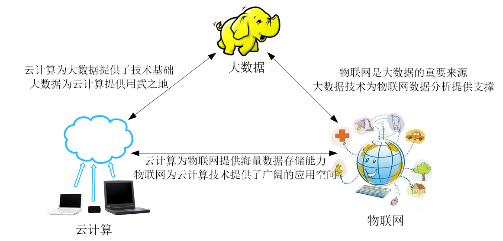

# 前言

1. 感谢：lqx（主要内容来源），hqh
2. 有自己的理解和魔改
3. 可以参考的资料
   1. [课后题答案](https://max.book118.com/html/2021/0104/7113031050003040.shtm)
   2. [我爬取的老师布置的学习通课后题](https://github.com/3210448723/python_practice/tree/main/%E7%88%AC%E5%8F%96%E5%A4%A7%E6%95%B0%E6%8D%AE%E5%AD%A6%E4%B9%A0%E9%80%9A%E9%A2%98%E5%BA%93)
   3. [往年资料](https://1905060202.github.io/2021/11/30/%E5%A4%A7%E6%95%B0%E6%8D%AE%E6%8A%80%E6%9C%AF%E5%8E%9F%E7%90%86%E4%B8%8E%E5%BA%94%E7%94%A8%E5%A4%8D%E4%B9%A0/)
   4. csdn里面找到的：[1](https://blog.csdn.net/qq_64575797/article/details/131206789)、[2](https://blog.csdn.net/qq_45812941/article/details/121218997?ops_request_misc=%257B%2522request%255Fid%2522%253A%2522168707250916800226565945%2522%252C%2522scm%2522%253A%252220140713.130102334..%2522%257D&request_id=168707250916800226565945&biz_id=0&utm_medium=distribute.pc_search_result.none-task-blog-2~all~baidu_landing_v2~default-5-121218997-null-null.142^v88^control_2,239^v2^insert_chatgpt&utm_term=%E5%A4%A7%E6%95%B0%E6%8D%AE%E6%8A%80%E6%9C%AF%E5%8E%9F%E7%90%86%E4%B8%8E%E5%BA%94%E7%94%A8%E5%A4%8D%E4%B9%A0&spm=1018.2226.3001.4187)
   5. [老师ppt](https://github.com/3210448723/BigDataCourse/tree/main/%E6%8E%88%E8%AF%BEPPT)
   6. [上课划重点录音](https://github.com/3210448723/BigDataCourse/tree/main/%E5%88%92%E9%87%8D%E7%82%B9%E5%BD%95%E9%9F%B3)
4. 不提供pdf文件，方便修改，如果需要可以自行转成pdf
5. 符号声明
   1. ※：补充内容，老师划重点时未明确提及
   2. ★：重点，老师明确点出的必考点
   3. ✦：大概率考，个人推测

6. 重点主要以1-4班的为主

# 题型

## 1-4班

1. 选择题（ 10 题×2分，共 20 分）
2. 简答题（ 6 题×8分，共 48 分）
3. 分析题（ 2 题×11分，共 22 分）
4. 论述题（共 10 分）

## 5-6班

### 题型

1. 选择10\*2
2. 简答6\*7
3. 分析2\*11
4. 论述16（送分题）

### 课后习题

1. 第一章1-12
2. 第二章1-4
3. 第三章1-9
4. 第四章1-3，5-18
5. 第七章4，6，13，16，实验五的实验内容和要求（1-3）
6. 第十章1，7，8

# 第一章 大数据概论

## 三次信息化浪潮

> 掌握标志和解决的问题

| 信息化浪潮 | 发生时间   | 标志                   | 解决的问题 | 代表企业                                        |
| ---------- | ---------- | ---------------------- | ---------- | ----------------------------------------------- |
| 第一次     | 1980年前后 | PC                     | 信息处理   | Intel、AMD、IBM、苹果、微软、联想、戴尔、惠普等 |
| 第二次     | 1995年前后 | 互联网                 | 信息传输   | 雅虎、谷歌、阿里巴巴、百度、腾讯等              |
| 第三次     | 2010年前后 | 大数据、云计算和物联网 | 信息爆炸   | 亚马逊、谷歌、IBM、VMware、阿里云等             |

## 信息科技为大数据时代提供的技术支撑

> 大数据出现的原因

1 . 存储设备容量不断增加

2 . CPU处理能力大幅提升

3 . 网络带宽不断增加

## 大数据的定义和特点

> 大数据的 4 个V，或者说是大数据的 4 个特点

1. 数据量大（Volume）
2. 数据类型繁多（Variety）
3. 处理速度快（Velocity）
4. 价值密度低（Value）

## 大数据的影响

### 对科学研究的影响

> 数据研究的阶段

第一种范式：实验科学

第二种范式：理论科学

第三种范式：计算科学

第四种范式：数据密集型科学

### 对思维方式的影响

全样而非抽样

效率而非精确

相关而非因果

## 大数据计算模式

| 大数据计算模式 | 解决问题                       | 代表产品                                              |
| -------------- | ------------------------------ | ----------------------------------------------------- |
| 批处理计算     | 针对大规模数据的批量处理       | MapReduce、Spark等                                    |
| 流计算         | 针对流数据的实时计算           | Storm、S4、Flume、Streams、Puma、银河流数据处理平台等 |
| 图计算         | 针对大规模图结构数据的处理     | Pregel、GraphX、Giraph、PowerGraph、Hama、GoldenOrb等 |
| 查询分析计算   | 大规模数据的存储管理和查询分析 | Dremel、Hive、Cassandra、Impala等                     |

## 大数据、云计算和物联网✦

> 三者概念和联系要掌握

### 概念

#### 大数据

[概念](#大数据的定义和特点)

#### 云计算

实现了通过网络提供可伸缩的、廉价的分布式计算机能力，用户只需要在具备网络接入条件的地方，就可以随时随地获得所需的各种IT资源。

#### 物联网

是物物相连的互联网，是互联网的延伸，它利用局部网络或互联网等通信技术把传感器、控制器、机器、人类和物等通过新的方式连在一起，形成人与物、物与物相连，实现信息化和远程管理控制。

### 关系

> 学习通第一章简答题33题

#### 区别

大数据侧重于海量数据的存储、处理与分析，海量数据中发现价值，服务于生产和生活；

云计算旨在整合和优化各种IT资源并通过网络以服务的方式，廉价地提供给用户；

物联网的发展目标是实现“物物相连”，应用创新是物联网的核心

#### 联系

> 相辅相成

大数据根植于云计算，大数据分析的很多技术都来自于云计算，没有云计算技术作为支撑，大数据分析就无从谈起。

大数据为云计算提供了“用武之地”，没有大数据这个“练兵场”，云计算再先进，也不能发挥其价值；

物联网构成了大数据的重要数据来源，物联网需要借助于云计算和大数据技术，实现物联网大数据的存储、分析和处理。

## 三种商业服务模式及其具体含义

### 基础设施即服务 (IaaS)

包含云 IT 的基本构建块，通常提供对联网功能、计算机（虚拟或专用硬件）以及数据存储空间的访问。基础设施即服务提供最高等级的灵活性和对 IT 资源的管理控制，其机制与现今众多 IT 部门和开发人员所熟悉的现有 IT 资源最为接近。

### 平台即服务 (PaaS)

消除了组织对底层基础设施的管理需要，可以将更多精力放在应用程序的部署和管理上面。有助于提高效率，不用操心资源购置、容量规划、软件维护、补丁安装或与应用程序运行有关的任何无差别的繁重工作。

### 软件即服务 (SaaS)

提供了一种完善的产品，其运行和管理皆由服务提供商负责。一般指的是终端用户应用程序。使用SaaS 产品时，不用知道服务的维护和底层基础设施的管理，只需要考虑怎样使用 SaaS 软件。

# 第二章 大数据处理架构Hadoop

## Hadoop的特性

###高可靠性

**采用冗余数据存储方式**，即使一个副本发生故障，其他副本也可以保证正常对外提供服务。

### 高效性

作为并行分布式计算平台，Hadoop采用**分布式存储和分布式处理**两大核心技术，**能够高**
**效地处理**PB级数据。

### 高可扩展性

Hadoop的设计目标是**可以高效稳定地运行在廉价的计算机集群**上，可以扩展到数以
千计的计算机节点上。

### 高容错性

**采用冗余数据存储方式，自动保存数据的多个副本**，并且能够自动将失败的任务进行重新分配。

### 成本低

Hadoop采用**廉价的计算机集群**，成本比较低，普通用户也很容易用自己的PC搭建
Hadoop运行环境。

### 运行在Linux平台上

Hadoop是**基于Java语言**开发的，可以较好地运行在Linux平台上。

### 支持多种编程语言

Hadoop上的应用程序也可以使用其他语言编写，如C/C++/python等。

## Hadoop生态系统

> 各个组件及其功能，不要求全部写出，挑几个写即可

| 组件          | 功能                                                         |
| ------------- | ------------------------------------------------------------ |
| **HDFS**      | 分布式文件系统，是Hadoop项目的两大**核心**之一。             |
| **MapReduce** | 分布式并行编程模型，是Hadoop项目的另一**核心**。其核心思想是“分而治之”。 |
| **Hive**      | 一个基于Hadoop的数据仓库工具，可以用于对Hadoop文件中的数据集进行整理、特殊查询和分析存储。 |
| **HBase**     | Hadoop上的一个高可靠性、高性能、可伸缩、实时读写、分布式的列式数据库。 |
| **Pig**       | 是一种数据流语言和运行环境，适合于使用Hadoop和MapReduce平台来查询大型半结构化数据集。 |
| Sqoop         | SQL-to-Hadoop的缩写，主要用于在Hadoop与传统数据库之间交换数据，可以改进数据的互操作性。 |
| Zookeeper     | 是对Google Chubby提供分布的一个开源实现，是高效和可靠的协同工作系统，提供分布式锁之类的基本服务，用于构建分布式应用，减轻分布式应用程序所承担的协调任务。是用Java语言编写的。 |
| Flume         | 一个高可用的，高可靠的，分布式的海量日志采集、聚合和传输的系统。 |
| Ambari        | 是一种基于Web的工具，支持Apache Hadoop集群的安装、部署、配置和管理。 |
| Mahout        | 提供一些可扩展的机器学习领域的经典算法的实现，旨在帮助开发人员更加快捷地创建智能应用程序。Mahout包含许多实现，如聚类、分类、推荐过滤、频繁子项挖掘等。通过使用Hadoop库，Mahout可以有效地扩展到云中。 |

# 第三章 分布式文件系统HDFS

## 分布式文件系统的结构

### 块

#### 定义※

在传统的文件系统中，为了提高磁盘读写效率，一般**以数据块为单位**，不以字节为单位。HDFS中的块，默认一个块大小为64MB，而HDFS中的文件会被拆分成多个块，每个块作为独立的单元进行存储。

#### 与普通文件系统中块的区别※

1. HDFS在块的大小的设计上明显要**大**于普通文件系统。
2. 在HDFS中，如果一个文件小于数据块的大小，它并**不占用整个**数据存储块的空间

#### 采用抽象的块概念的好处

1. 减少源数据数量

   > 采用大数据块的好处

2. 支持大规模文件存储

   文件以块为单位进行存储，一个大规模文件可以被分拆成若干个文件块，不同的文件块可以被分发到不同的节点上，因此一个文件的大小不会受到单个节点的存储容量的限制，可以远远大于网络中任意节点的存储容量。

3. 简化系统设计

   1. 大大简化了**存储管理**，因为文件块大小是固定的，这样就可以很容易计算出一个节点可以存储多少文件块；
   2. 方便**管理元数据**，元数据不需要和文件块一起存储，可以由其他系统负责管理元数据。

4. 适合数据备份

   每个文件块都可以**冗余存储**到多个节点上，大大提高了系统的容错性和可用性。

### 名称节点和数据节点

> 掌握功能

#### 名称节点/主节点/Master

负责管理分布式文件系统系统的命名空间，记录分布式文件系统中的每个文件中各个块所在的数据节点的位置信息；

#### 数据节点/从节点/Slave

是分布式文件系统HDFS的工作节点，负责数据的存储和读取，会根据客户端或者是名称节点的调度来进行数据的存储和检索，并向名称节点定期发送自己所存储的块的列表。

## HDFS体系结构

### 简介

HDFS采用主从（Master/Slave）结构模型，一个HDFS集群包括一个名称节点（NameNode）和若干个数据节点（DataNode）。

### 优势※

兼容廉价的硬件设备

流数据读写

大数据集

简单的文件模型

强大的跨平台兼容性

### 局限性

#### 命名空间的限制

名称节点是保存在内存中的，因此名称节点能够容纳对象(文件、块)的个数会受到内存空间大小的限制。

#### 性能的瓶颈

整个分布式文件系统的吞吐量受限于单个名称节点的吞吐量。

#### 隔离问题

由于集群中只有一个名称节点，只有一个命名空间，因此无法对不同应用程序进行隔离。

#### 集群的可用性

一旦这个唯一的名称节点发生故障，会导致整个集群变得不可用。

## HDFS存储原理

### 数据冗余存储※

#### 原因

作为一个分布式文件系统，为了保证系统的容错性和可用性，HDFS采用了多副本方式对数据进行冗余存储，通常一个数据块的多个副本会被分布到不同的数据节点上。

#### 作用

##### 加快数据传输速度

当多个客户端需要同时访问同一个文件时，可以让各个客户端分别从不同的数据块副本中读取数据，这就大大加快了数据传输速度

##### 容易检查数据错误

HDFS的数据节点之间通过网络传输数据，采用多个副本可以很容易判断数据传输是否出错

##### 保证数据的可靠性

即使某个数据节点出现故障失效，也不会造成数据丢失

### 数据存储策略

#### 数据存放

> 三个副本是怎么存放的

1. 第一个副本

   1. 在集群内发起写操作请求

      放置在发起写操作请求的数据节点上，就近写入数据。

   2. 在集群外部的写操作请求

      挑选一台磁盘不太满、CPU不太忙的数据节点

2. 第二个副本

   放置在与第一个副本不同的机架的数据节点上

3. 第三个副本

   放置在与第一个副本相同的机架的其他节点上

4. 更多的副本

   从集群中随机选择数据节点进行存放

#### 数据读取

1. 从名称节点获得数据块不同副本的存放位置列表，列表中包含了副本所在的数据节点调用API来确定客户端和这些数据节点所属的机架
2. 当发现某个数据块副本对应的机架ID和客户端对应的机架ID相同时，就优先选择该副本读取数据
3. 如果没有发现，就随机选择一个副本读取数据

#### 数据复制

采用了**流水线复制**的策略，大大提高了数据复制过程的效率。

1. 当客户端要往HDFS中写入一个文件时，首先被写入本地，并被切分成若干个块，每个块的大小由HDFS的设定值决定。
2. 每个块都向HDFS集群中的名称节点发起写请求，名称节点会根据系统中各个数据节点的使用情况，选择一个数据节点列表返回给客户端，
3. 客户端把数据首先写入列表中的第一个数据节点，同时把列表传给第一个数据节点，当第一个数据节点接收到4KB数据时，写入本地，并且向列表中的第二个数据节点发起连接请求，把自己已经接收到的4KB数据和列表传给第二个数据节点，当第二个数据节点接收到4KB数据时，写入本地，并且向列表中的第三个数据节点发起连接请求，依次类推，列表中的多个数据节点形成一条数据复制的流水线。
4. 当文件写完的时候，数据复制也同时完成。

### 数据错误与恢复（了解）※

#### 名称节点出错

名称节点保存了所有的元数据信息，其中最核心的两大数据结构是FsImage和EditLog，如果这两个文件发生损坏，那么整个HDFS实例将失效。Hadoop采用两种机制来确保名称节点的安全：

1. 把名称节点上的元数据信息同步存储到其他文件系统(比如远程挂载的网络文件系统NFS)中；
2. 运行一个第二名称节点，当名称节点宕机以后，可以把第二名称节点作为一种弥补措施，利用第二名称节点中的元数据信息进行系统恢复。

但从前面对第二名称节点的介绍中可以看出，这样做仍然会丢失部分数据。因此，一般会把上述两种方式结合使用，当名称节点发生宕机时，首先到远程挂载的网络文件系统中获取备份的元数据信息，放到第二名称节点上进行恢复，并把第二名称节点作为名称节点来使用。

#### 数据节点出错

每个数据节点会定期向名称节点发送“心跳”信息，向名称节点报告自己的状态。

当数据节点发生故障，或者网络发生断网时，名称节点就无法收到来自一些数据节点的“心跳”信息，这时这些数据节点就会被标记为“宕机”，节点上面的所有数据都会被标记为“不可读”，名称节点不会再给它们发送任何I/O请求。

这时，有可能出现一种情形，即由于一些数据节点的不可用，会导致一些数据块的副本数量小于冗余因子。

名称节点会定期检查这种情况，一旦发现某个数据块的副本数量小于冗余因子，就会启动数据冗余复制，为它生成新的副本。

HDFS与其他分布式文件系统的最大区别就是可以调整冗余数据的位置。

#### 数据出错

网络传输和磁盘错误等因素都会造成数据错误。客户端在读取到数据后，会采用MD5和SHA-1对数据块进行校验，以确定读取到正确的数据。

在文件被创建时，客户端就会对每一个文件块进行信息摘录，并把这些信息写入同一个路径的隐藏文件里面。

当客户端读取文件的时候，会先读取该信息文件，然后利用该信息文件对每个读取的数据块进行校验，如果校验出错，客户端就会请求到另外一个数据节点读取该文件块，并且向名称节点报告这个文件块有错误，名称节点会定期检查并且重新复制这个块。

# 第四章 分布式数据库HBase

## BigTable

> 了解其基本情况，是如何保存信息的，理解

* BigTable是一个**分布式存储系统**；
* 利用谷歌提出的**MapReduce**分布式并行计算模型来处理海量数据；
* 使用谷歌分布式文件系统**GFS**作为底层数据存储；
* 采用Chubby提供协同服务管理；
* 可以扩展到PB级别的数据和上千台机器，具备广泛应用性、可扩展性、高性能和高可用性等特点；

## HBase简介※

HBase是一个高可靠、高性能、面向列、可伸缩的分布式数据库，是谷歌BigTable的开源实现，主要用来存储非结构化和半结构化的松散数据。

HBase的目标是处理非常庞大的表，可以通过水平扩展的方式，利用廉价计算机集群处理由超过 10 亿行数据和数百万列元素组成的数据表。

HBase实际上是一个稀疏、多维、持久化存储的映射表，采用行键、列族、列限定符、时间戳进行索引，每个值都是未经解释的字符串（字符数组）。

## HBase与传统关系数据库的区别

> 具体内容，六个方面，可能选择题，要会判断对错

### 数据类型

关系数据库采用**关系模型**，具有丰富的数据类型和存储方式

HBase则采用了更加简单的**数据模型**，它把数据存储为未经解释的字符串

### 数据操作

关系数据库中包含了丰富的操作，其中会涉及**复杂**的多表连接

HBase操作则不存在复杂的表与表之间的关系，只有**简单**的插入、查询、删除、清空等

### 存储模式

关系数据库是基于**行模式**存储的，元组或行会被连续地存储在磁盘页中

HBase是基于**列存储**的，每个列族都由几个文件保存，不同列族的文件是分离的

### 数据索引

关系数据库通常可以针对**不同列**构建复杂的多个索引，以提高数据访问性能

HBase**只有一个行键索引**，HBase中的所有访问方法，或者通过行键访问，或者通过行键扫
描，从而使得整个系统不会慢下来

### 数据维护

在关系数据库中，更新操作会用最新的当前值去**替换**记录中原来的旧值，旧值被覆盖后就不会存在

HBase中执行更新操作时，并不会删除数据旧的版本，而是生成一个新的版本，旧有的版本仍然**保留**

### 可伸缩性

关系数据库很难实现横向扩展，纵向扩展的空间也比较有限

HBase等分布式数据库能够轻易地通过在集群中增加或者减少硬件数量来实现性能的伸缩

> 相对于关系数据库来说，HBase也有自身的局限性，如HBase不支持事务，因此无法实现跨行的原子性。

## HBase的实现原理

### 功能组件※

#### 库函数

链接到每个客户端

#### 一个Master主服务器

负责管理和维护HBase表的分区信息，维护Region服务器列表，分配Region，负载均衡。

#### 许多个Region服务器

负责存储和维护分配给自己的Region，处理来自客户端的读写请求。

### 表和Region

> 要仔细地搞清楚

在一个HBase中存储了许多表，表内包含的行数可能非常大，无法存储在一台机器上，因此需要分区。

一个HBase表会被划分成多个Region（根据行键的值），Region包含位于某个值域区间内的所有数据，是负载均衡和数据分发的基本单位，它们会被分发到不同的Region服务器上。

初始时，每个表只包含一个Region，随着数据的不断插入，Region会持续增大，当一个Region中包含的行数量达到一个阈值时，就会被自动等分成两个新的Region。随着表中行的数量继续增加，就会分裂出越来越多的Region。

### Region的定位

> 是如何定位的

通过构建的映射表（.META.表），映射表的每个条目（或每行）包含两项内容，一个是Region标识符，另一个是Region服务器标识。这个条目就表示Region和Region服务器之间的对应关系，从而就可以知道某个Region被保存在哪个Region服务器中。

> 当HBase表很大时， .META.表也会被分裂成多个Region；
>
> -ROOT-表只有唯一一个Region，名字是在程序中被“写死”的，Master主服务器永远知道其位置。

### HBase的三层结构

> 重点掌握“HBase的三层结构中各层次的名称和作用”这个表，各层名称和作用

| 层次   | 名称          | 作用                                                         |
| ------ | ------------- | ------------------------------------------------------------ |
| 第一层 | Zookeeper文件 | 记录了-ROOT-表的位置信息。                                   |
| 第二层 | -ROOT-表      | 记录了.META.表的Region位置信息  -ROOT-表只能有一个Region。通过-ROOT-表，就可以访问.META.表中的数据。 |
| 第三层 | .META.表      | 记录了用户数据表的Region位置信息，.META.表可以有多个Region，保存了HBase中所有用户数据表的Region位置信息。 |

## HBase的运行机制

### HBase系统架构※

#### 客户端

客户端包含访问HBase的接口，同时在缓存中维护着已经访问过的Region位置信息，用来加快后续数据访问过程

#### Zookeeper服务器

Zookeeper可以帮助选举出一个Master作为集群的总管，并保证在任何时刻总有唯一一个Master在运行，这就避免了Master的“单点失效”问题

#### Master

主服务器Master主要负责表和Region的管理工作

1. 管理用户对表的增加、删除、修改、查询等操作
2. 实现不同Region服务器之间的负载均衡
3. 在Region分裂或合并后，负责重新调整Region的分布
4. 对发生故障失效的Region服务器上的Region进行迁移

#### Region服务器

Region服务器是HBase中最核心的模块，负责维护分配给自己的Region，并响应用户的读写请求

### Region服务器工作原理

Region服务器内部管理一系列Region对象和一个HLog文件，其中，HLog是磁盘上面的记录文件，它记录着所有的更新操作。每个Region对象又是由多个Store组成的，每个Store对象了表中的一个列族的存储。每个Store又包含了MemStore和若干个StoreFile，其中，MemStore是在内存中的缓存，保存最近更新的数据；StoreFile是磁盘中的文件，采取B+树结构，方便快速读取。

#### 用户读写数据的过程

* 用户写入数据时，被分配到相应Region服务器去执行；
* 用户数据首先被写入到MemStore和Hlog中；
* 只有当操作写入Hlog之后，commit( )调用才会将其返回给客户端；
* 当用户读取数据时，Region服务器会首先访问MemStore缓存，如果找不到，再去磁盘上面的StoreFile中寻找。

#### 缓存的更新

* 系统定期把MemStore缓存写入StoreFile文件中，清空缓存，然后在HLog中写入一个标记，表示缓存中的内容已被写入StoreFile中
* 每次刷写都生成一个新的StoreFile文件，因此，每个Store包含多个StoreFile文件；
* 每个Region服务器都有一个自己的HLog 文件，每次启动都检查该文件，确认最近一次执行缓存刷新操作之后是否发生新的写入操作；如果发现更新，则先写入MemStore，再刷写到StoreFile，最后删除旧的Hlog文件，开始为用户提供服务

#### StoreFile的合并

* 每次MemStore缓存的刷新操作都会在磁盘上生成一个新的StoreFile文件，所以每个Store就会存在多个StoreFile文件。
* 为了减少查找时间，系统一般会调用Store.compact()把多个StoreFile文件合并成一个大文件。
* 合并操作比较耗费资源，只有数量达到一个阈值才启动合并。

### Store工作原理

> 学习通简答题28题

每个Store对应了表中的一个列族的存储。每个Store包括一个MenStore缓存和若干个StoreFile文件。MenStore是排序的内存缓冲区，当用户写入数据时，系统首先把数据放入MenStore缓存，当MemStore缓存满时，就会刷新到磁盘中的一个StoreFile文件中，当单个StoreFile文件大小超过一定阈值时，就会触发文件分裂操作。

### HLog

> 学习通简答题27题

#### 工作原理

HBase系统为**每个Region服务器**配置了一个HLog文件，它是一种预写式日志（Write Ahead
Log），用户更新数据必须首先写入日志后，才能写入MemStore缓存，直到MemStore缓存内容对应的日志已经写入磁盘，该缓存内容才能被刷写到磁盘。

#### 每个Region服务器维护一个HLog，而不是为每个Region都单独维护一个HLog的优缺点

> 优缺点在学习通简答题29题

##### 优点

多个Region对象的更新操作所发生的日志修改，只需要不断把日志记录追加到单个日志文件中，不需要同时打开、写入到多个日志文件中，可以减少磁盘寻址次数，**提高对表的写操作性能**。

##### 缺点

如果一个Region服务器发生故障，为了恢复其上的Region对象，需要将Region服务器上的HLog按照其所属的Region对象进行**拆分**，然后分发到其他Region服务器上执行恢复操作，**开销大**。

# 第七章 MapReduce

## 概述

### 分布式并行编程※

分布式并行编程与传统的程序开发方式有很大的区别。传统的程序都是以单指令、单数据流的方式顺序执行，虽然这种方式比较符合人类的思维习惯，但是这种程序的性能受到单台机器性能的限制，可扩展性较差。分布式并行程序可以运行在由大量计算机构成的集群上，从而可以充分利用集群的并行处理能力，同时通过向集群中增加新的计算节点，就可以很容易地实现集群计算能力的扩充。

### MapReduce模型

#### 简介※

MapReduce将复杂的、运行于大规模集群上的并行计算过程高度地抽象到两个函数：Map和
Reduce，这两个函数及其核心思想都源自函数式编程语言。

在MapReduce中，一个存储在分布式文件系统中的大规模数据集会被切分成许多独立的小数据块，可以被多个Map任务并行处理。MapReduce框架会为每个Map任务输入一个数据子集，Map任务生成的结果会继续作为Reduce任务的输人，最终由Reduce任务输出最后结果，并写人分布式文件系统。

MapReduce设计的一个理念就是“计算向数据靠拢“，在一个集群中，只要有可能，MapReduce框架就会将Map程序就近地在HDFS数据所在的节点运行，即将计算节点和存储节点放在一起运行，从而减少了节点间的数据移动开销。

#### 适用的前提条件

待处理的数据集可以分解成许多小的数据集，而且每一个小数据集都可以完全独立地并行地进行处理。

#### 缺点※

参考[Hadoop缺点](#Hadoop缺点)

### Map和Reduce函数※

MapReduce模型的核心是Map函数和Reduce函数，二者都是由应用程序开发者负责具体实现的。
MapReduce编程之所以比较容易，是因为程序员只要关注如何实现Map和Reduce函数，而不需要处理并行编程中的其他各种复杂问题，如分布式存储、工作调度、负载均衡、容错处理网络通信等，这些问题都会由MapReduce框架负责处理。

## 体系结构

> 主从模式：Master/Slave，组件以及对应的功能

### Client

用户编写的MapReduce程序通过Client提交到JobTracker端；

用户可通过Client提供的一些接口查看作业运行状态。

### JobTracker

运行在Master主节点上，负责资源监控和作业调度

### TaskTracker

运行在Slave从节点上，周期性通过“心跳”将本节点上资源的使用情况和任务运行进度汇报给JobTracker，同时接收JobTracker发送过来的命令并执行相应操作

### Task

分为Map Task和Reduce Task，均由TaskTracker启动

## MapReduce工作流程★

> 分析题11分，根据题目给出的具体问题示例（比如学习通作业题第7章简答题13题），写出一般的，通用的算法思路：map的输入输出，reduce的处理步骤等等。虽然老师稍微提了下算法思想，但是感觉和执行阶段差不多

### 工作流程概述※

InputSplit → Map → Shuffle（Partition → Sort → Combine → Merge） → Reduce

> 与下面的执行阶段相对应

### 执行阶段

1. 使用InputFormat模块做Map前的预处理，然后将输入文件切分为逻辑上的多个InputSplit，每个InputSplit并没有对文件进行实际切割，只是记录了要处理的数据的位置和长度。
2. 通过RecordReader(RR)根据InputSplit中的信息来处理InputSplit中的具体记录，加载数据并转换为适合Map任务读取的键值对，输入给**Map任务**。
3. Map任务根据用户自定义的映射规则，输出一系列的<key,value>作为中间结果。
4. 为了让Reduce可以并行处理Map的结果，需要对Map的输出进行一定的分区、排序、合并、归并等操作，得到<key,value\-list>形式的中间结果，再交给**对应的Reduce**进行处理，这个过程将**无序**的<key,value>处理成**有序**的<key,value\-list>，称为**Shuffle**（洗牌）。
5. Reduce以一系列<key,value\-Iist>中间结果作为输入，执行用户定义的逻辑，输出结果给OutputFormat模块。
6. OutputFormat模块会验证输出目录是否已经存在以及输出结果类型是否符合配置文件中的配置类型，如果都满足，就输出Reduce的结果到分布式文件系统。

# 第十章 Spark

## 特点

> 稍微展开描述一下，不能只写这几个标题

### 运行速度快

使用DAG执行引擎以支持循环数据流与内存计算

### 容易使用

支持使用Scala、Java、Python和R语言进行编程，可以通过Spark Shell进行交互式编程

### 通用性

Spark提供了完整而强大的技术栈，包括SQL查询、流式计算、机器学习和图算法组件

### 运行模式多样

可运行于独立的集群模式中，可运行于Hadoop中，也可运行于Amazon EC2等云环境中，并且可以访问HDFS、Cassandra、HBase、Hive等多种数据源。

## Spark与Hadoop对比

> 两者优缺点相反

### Hadoop缺点

#### 表达能力有限

计算都**必须**要转化成**Map和Reduce**两个操作，但这并不适合所有的情况，难以描述复杂的数据处理过程。

#### 磁盘IO开销大

每次执行时都需要**从磁盘读取**数据，并且在计算完成后需要将中间结果**写入到磁盘**中，IO开销较大。

#### 延迟高

一次计算可能需要分解成一系列按顺序执行的MapReduce任务，任务之间的衔接由于涉及
到 IO 开销，会产生较高延迟。而且，在前一个任务执行完成之前，其他任务无法开始，因此难以胜任复杂、多阶段的计算任务。

### Spark优点

#### 编程模型灵活

Spark的计算模式也属于MapReduce，但不局限于Map和Reduce操作，提供了多种数据集操作类型，编程模型比MapReduce更**灵活**。

#### 运算效率高

Spark提供了内存计算，**中间结果直接放到内存中**，带来了更高的迭代运算**效率**。

#### 任务调度机制优

Spark基于DAG的**任务调度执行机制**，要优于MapReduce的迭代执行机制。

## Spark生态系统

> 学习通简答题11题

### BDAS架构※

### 组件功能

#### Spark Core

Spark Core包含Spark的基本功能，如内存计算、任务调度、部署模式、故障恢复、存储管理等，主要面向批数据处理。Spak建立在统一的抽象RDD之上，使其可以以基本一致的方式应对不同的大数据处理场景。

#### Spark SQL

Spark SQL允许开发人员直接处理RDD，同时也可查询Hive、HBase等外部数据源。能够统一处理关系表和RDD。

#### Spark Streaming

Spark Streaming支持高吞吐量、可容错处理的实时流数据处理，其核心思路是将流数据分解成一系列短小的批处理作业，每个短小的批处理作业都可以使用Spark Core进行快速处理。支持多种数据输人源，如Kafa、Flume和TCP套接字等。

#### Structured Streaming

是一种基于Spark SQL引擎构建的、可扩展且容错的流处理引擎。通过一致的API，使用者可像编写批处理程序一样编写流处理程序。

#### MLlib/机器学习

MLib提供了常用机器学习算法的实现，包括聚类、分类、回归、协同过滤等，降低了机器学习的门槛，开发人员只要具备一定的理论知识就能进行机器学习的工作。

#### GraphX/图计算

GraphX是Spark中用于图计算的API，可认为是Pregel在Spark上的重写及优化，GraphX性能良好，拥有丰富的功能和运算符，能在海量数据上自如地运行复杂的图算法。

### 组件的应用场景✦

> 注意出题时引用场景不同表达方式的替换，也许不会出简答题

| 应用场景                           | 时间跨度     | 其他框架              | Spark生态系统中的组件 |
| ---------------------------------- | ------------ | --------------------- | --------------------- |
| 复杂的批量数据处理                 | 小时级       | MapReduce、Hive       | Spark                 |
| 基于历史数据的交互式查询           | 分钟级、秒级 | Impala、Dremel、Drill | Spark SQL             |
| 基于实时数据流的数据处理           | 毫秒、秒级   | Storm、S4             | Spark Streaming       |
| 基于历史数据的数据挖掘（机器学习） | -            | Mahout                | MLlib                 |
| 图结构数据的处理（图计算）         | -            | Pregel、Hama          | GraphX                |

## 基本概念★

> 学习通作业简答题15题

### RDD

弹性分布式数据集（Resilient Distributed Dataset），是分布式内存的一个抽象概念，提供了一种高度受限的共享内存模型。

### DAG

有向无环图（Directed Acyclic Graph），反映RDD之间的依赖关系。

### 阶段

是作业的基本调度单位，一个作业会分为多组任务，每组任务被称为“阶段”（Stage），或者也被称为“任务集”。

### Task（任务）※

运行在Executor上的工作单元 。

### Job（作业）※

一个Job包含多个RDD及作用于相应RDD上的各种操作。

### 分区

一个RDD就是一个分布式对象集合，本质上是一个只读的分区记录集合，每个RDD可以分成
多个分区，每个分区就是一个数据集片段。

### 窄依赖

父RDD的一个分区只被一个子RDD的一个分区所使用就是窄依赖。

### 宽依赖

父RDD的一个分区被一个子RDD的多个分区所使用就是宽依赖。

## 运行基本流程✦

1. 当一个Spak应用被提交时，首先需要为这个应用构建起基本的运行环境，即由任务控制节点（Driver）创建一个SparkContext，由SparkContext负责和资源管理器(Cluster Manager)的通信以及进行资源的申请、任务的分配和监控等。

2. 资源管理器为Executor分配资源，并启动Executor进程，Executor运行情况将随着“心跳”发送到资源管理器上。

   > Executor是多线程的，每一个线程执行其中一个任务

3. SparkContext根据RDD的依赖关系构建DAG图，DAG图提交给DAG调度器(DAGScheduler)进行解析，将DAG图分解成多个“阶段”，并且计算出各个阶段之间的依赖关系，然后把一个个“任务集”提交给底层的任务调度器(TaskScheduler)进行处理；Executor向SparkContext申请任务，任务调度器将任务分发给Executor运行，同时SparkContext将应用程序代码发放给Executor

4. 任务在Executor上运行，把执行结果反馈给任务调度器，然后反馈给DAG调度器，运行完毕后写入数据并释放所有资源

# 论述题

> 猜测

## 大数据的思维特性

> new bing

1. 全样思维：即从全部样品中抽取一部分样品单位，保证所抽取的样品单位对全部样品具有充分的代表性。
2. 容错思维：即在处理大数据时，要考虑到数据质量的不确定性和不完整性，采用容错技术进行处理。
3. 相关思维：即通过对大量数据进行分析，发现其中的相关关系，从而得出结论。
4. 实验思维：即通过实验来验证假设或推断。

## 谈谈你对大数据学习的看法，如果以后从事大数据行业，需要在哪些方面加强学习？

### 看法

> GPT 3.5

1. 巨大的机遇：大数据学习为我们提供了利用海量数据来解决问题和做出决策的机会。通过对大数据的深入研究和分析，我们可以发现隐藏在数据中的宝贵信息，从而为企业、政府和学术界等提供更好的决策依据。
2. 挑战与需求：大数据学习面临着处理、存储和分析大规模数据的挑战。因此，对于大数据学习来说，具备数据处理、数据挖掘、机器学习和统计分析等技能是至关重要的。此外，对于数据隐私和安全等问题也需要重视。
3. 实践与理论相结合：大数据学习需要将理论知识与实践技能相结合。理论知识包括数据分析方法、统计学原理和机器学习算法等，而实践技能则包括数据清洗、数据可视化和模型建立等。只有理论与实践相结合，才能真正应对大数据时代的挑战。
4. 跨学科性质：大数据学习是一门跨学科的领域，涉及计算机科学、数学、统计学、经济学和领域专业知识等多个学科。因此，学习者需要具备广泛的知识背景和技能，以便有效地处理和分析各个领域的大数据。
5. 持续学习与创新：大数据学习是一个不断发展和变化的领域，新的技术和方法不断涌现。因此，学习者需要具备持续学习和创新的能力，不断跟进最新的研究成果和技术进展，以保持竞争力。

### 学习

> new bing

1. 数据库技术：包括关系型数据库和非关系型数据库，如MySQL、Oracle、MongoDB等。
2. 大数据技术：包括Hadoop、Spark、Flink等大数据处理框架，以及Hive、Pig等大数据处理工具。
3. 数据挖掘和机器学习：包括分类、聚类、回归等机器学习算法，以及Python、R等编程语言。
4. 数据可视化：包括Tableau、Power BI等数据可视化工具。
